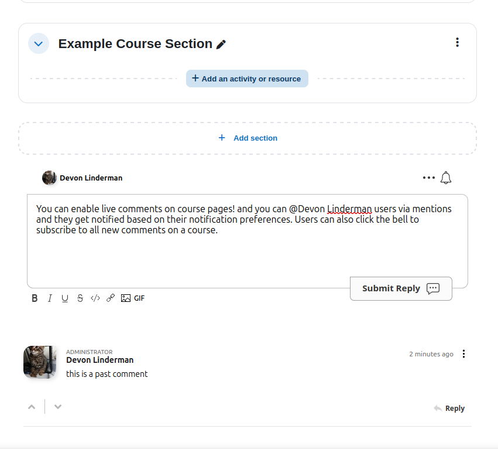
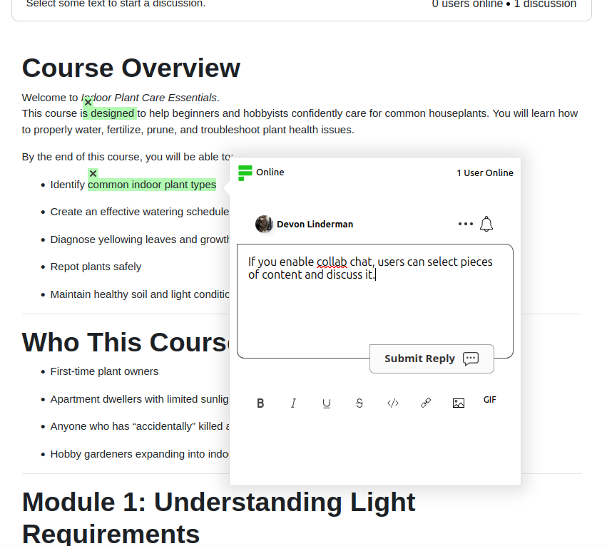
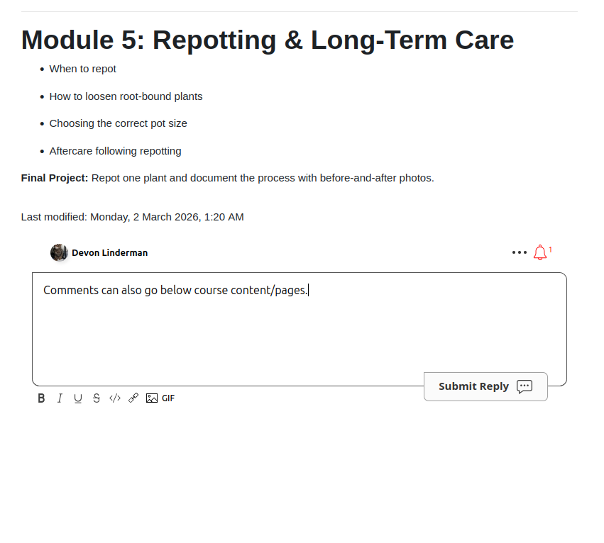

# FastComments for Moodle

Add threaded commenting and collaborative/inline chat to your Moodle courses and activities with [FastComments](https://fastcomments.com).

## Screenshots

### Course Page Comments

Live comments on course pages. Users can @mention each other and get notified based on their notification preferences. Click the bell to subscribe to all new comments on a course.

The rich text editor supports links, images, GIFs, and more. All of these can be configured or disabled.

### Collaborative Chat

With collab chat enabled, users can select pieces of content and discuss it. A top bar prompts "Select some text to start a discussion" and shows online user count and active discussions. Highlighted text is anchored in place so the conversation stays tied to the content.

### Module / Page Comments

Comments can also go below course content and pages (modules, books, etc.). The notification bell shows when there are unread notifications.

## Features

- Threaded comments with @mentions, upvoting/downvoting, and reply chains
- Rich text editor:bold, italic, underline, strikethrough, code blocks, links, images, and GIFs
- Collaborative chat:select text on any page to start an inline discussion anchored to that content
- Online presence indicator showing who is currently viewing the page
- Users seamlessly logged into the comment area. Secure SSO (HMAC-SHA256) and Simple SSO for seamless Moodle login integration
- Moodle admins are automatically synced as FastComments moderators (with Secure SSO)
- Comments on course pages and/or individual module/activity pages (configurable)
- Notification bell with unread badge:users can subscribe to all new comments on a page
- Per-user notification preferences accessible from the user profile
- EU CDN option for GDPR-friendly deployments
- Three commenting styles: traditional comments, collab chat, or both combined

## Requirements

- Moodle 4.1 or later
- PHP 7.4+ (as required by Moodle 4.1)
- A [FastComments](https://fastcomments.com) account (Tenant ID required; API Secret required for Secure SSO). Free trial allows testing the plugin. Plans start at $0.99/mo.

## Installation

1. Get the plugin from the [Moodle Plugin Directory](https://moodle.org/plugins/local_fastcomments). You can install it directly from within Moodle's plugin installer, or download the ZIP and extract it into your Moodle installation at `/path/to/moodle/local/fastcomments`.

2. Log in as a site administrator and visit **Site Administration > Notifications**. Moodle will detect the new plugin and run the install.

3. Navigate to **Site Administration > Plugins > Local plugins > FastComments** to configure.

## Configuration

Go to **Site Administration > Plugins > Local plugins > FastComments**. The settings are:

| Setting | Description |
|---|---|
| **Tenant ID** | Your FastComments Tenant ID (found in your FastComments dashboard). |
| **API Secret** | Your FastComments API Secret. Required when using Secure SSO. |
| **SSO Mode** | Choose Secure, Simple, or None (see [SSO Modes](#sso-modes) below). |
| **Page Contexts** | Which page types display comments:course pages, module/activity pages, or both. |
| **Commenting Style** | Select from three modes (see [Commenting Styles](#commenting-styles) below). |
| **CDN URL** | Defaults to `https://cdn.fastcomments.com`. Change to an EU CDN endpoint if needed. |

## Commenting Styles

| Style | Behavior |
|---|---|
| **Comments** | A comment widget is rendered below the page content with threaded replies, @mentions, and the notification bell. |
| **Collab Chat** | A bar appears at the top of the page prompting users to select text and start a discussion. Highlighted text is anchored to the content. Shows online users and active discussion count. No bottom widget. |
| **Collab Chat + Comments** | Both modes active:users can highlight text for inline discussions and also use the comment widget below the content. |

## SSO Modes

| Mode | How it works |
|---|---|
| **Secure** (recommended) | User identity is signed server-side with HMAC-SHA256 using your API Secret. Moodle admins are automatically synced as FastComments moderators. User avatars, names, and email addresses are passed securely. |
| **Simple** | User data (name, email, avatar) is passed client-side without a signature. Quick to set up but less secure. |
| **None** | No SSO:users comment anonymously. |

## User Preferences

Logged-in users can manage their FastComments notification settings from their Moodle profile under the **FastComments** section. Two preferences are available:

- **Reply notifications**:receive an email when someone replies to your comment.
- **Subscription notifications**:receive emails for threads you have subscribed to.

## License

This plugin is licensed under the [GNU General Public License v3 or later](https://www.gnu.org/licenses/gpl-3.0.html).
